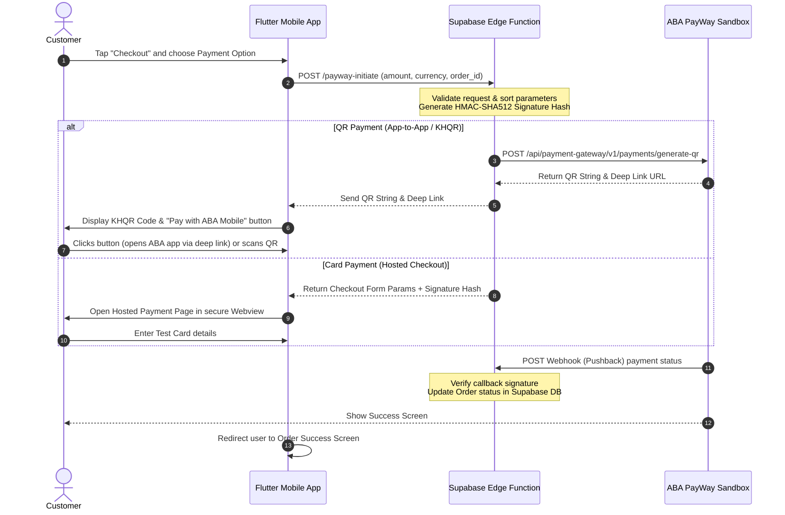

# ABA PayWay Integration Guide (Sandbox Mode)

This guide provides a step-by-step walkthrough to integrate **ABA PayWay** into the **UrComputer** mobile application using **Supabase** for secure backend operations. It covers both **ABA KHQR (QR payment)** and **Credit/Debit Card transactions** in **Sandbox Mode**.

---

## 1. Integration Architecture

For security reasons, **never store your ABA PayWay API Secret Key inside the mobile application**. Doing so exposes your credentials to reverse engineering. Instead, we use a secure backend layer (e.g., Supabase Edge Functions) to generate signature hashes and communicate with the PayWay API.



---

## 2. Sandbox Credentials & Endpoints

To test transactions, you must register for a sandbox merchant account at the [ABA PayWay Developer Suite](https://developer.payway.com.kh/).

### Sandbox Endpoints
*   **Generate QR API:** `https://checkout-sandbox.payway.com.kh/api/payment-gateway/v1/payments/generate-qr`
*   **Hosted Checkout Web Page:** `https://checkout-sandbox.payway.com.kh/api/payment-gateway/v1/payments/purchase`

### Test Credentials (Placeholder Example)
Store these values securely in your backend environment variables (`.env` in Supabase Edge Functions):
```ini
ABA_PAYWAY_MERCHANT_ID="ec484646" # Replace with your sandbox Merchant ID
ABA_PAYWAY_API_KEY="your_sandbox_api_key_here"
```

---

## 3. Backend: Supabase Edge Function

Create a Supabase Edge Function (e.g., named `payway-checkout`) to securely generate the required signatures.

### `supabase/functions/payway-checkout/index.ts`

```typescript
import { serve } from "https://deno.land/std@0.168.0/http/server.ts";
import { crypto } from "https://deno.land/std@0.168.0/crypto/mod.ts";

const corsHeaders = {
  "Access-Control-Allow-Origin": "*",
  "Access-Control-Allow-Headers": "authorization, x-client-info, apikey, content-type",
};

serve(async (req) => {
  // Handle CORS preflight
  if (req.method === "OPTIONS") {
    return new Response("ok", { headers: corsHeaders });
  }

  try {
    const { orderId, amount, currency, firstName, lastName, email, phone, paymentOption } = await req.json();

    const merchantId = Deno.env.get("ABA_PAYWAY_MERCHANT_ID") || "ec484646";
    const apiKey = Deno.env.get("ABA_PAYWAY_API_KEY") || "your_sandbox_api_key_here";
    
    // Format request time: YYYYMMDDHHMMSS
    const reqTime = new Date().toISOString()
      .replace(/[-T:]/g, "")
      .split(".")[0];

    // 1. Prepare payment transaction details
    const transactionData: Record<string, any> = {
      req_time: reqTime,
      merchant_id: merchantId,
      tran_id: orderId,
      amount: amount.toString(),
      currency: currency || "USD",
      purchase_type: "purchase",
      payment_option: paymentOption || "abapay_khqr", // 'abapay_khqr' or 'cards'
      first_name: firstName || "Customer",
      last_name: lastName || "User",
      email: email || "customer@example.com",
      phone: phone || "012345678",
    };

    // For QR codes, we must supply items base64 encoded
    const items = [{ name: `Order #${orderId}`, quantity: 1, price: amount }];
    const itemsJsonStr = JSON.stringify(items);
    // Base64 encoding items
    transactionData.items = btoa(itemsJsonStr);

    // 2. Generate HMAC-SHA512 Hash Signature
    // Process: Sort parameters alphabetically, concatenate values, encrypt with ApiKey using HMAC-SHA512, Base64 encode
    const sortedKeys = Object.keys(transactionData).sort();
    let concatenatedString = "";
    for (const key of sortedKeys) {
      concatenatedString += transactionData[key];
    }

    const keyBuf = new TextEncoder().encode(apiKey);
    const dataBuf = new TextEncoder().encode(concatenatedString);
    
    const cryptoKey = await crypto.subtle.importKey(
      "raw",
      keyBuf,
      { name: "HMAC", hash: "SHA-512" },
      false,
      ["sign"]
    );
    
    const signatureBuffer = await crypto.subtle.sign(
      "HMAC",
      cryptoKey,
      dataBuf
    );
    
    const hash = btoa(String.fromCharCode(...new Uint8Array(signatureBuffer)));
    transactionData.hash = hash;

    // 3. Handle specific flow based on user choice
    if (paymentOption === "abapay_khqr") {
      // Direct API call to ABA to fetch QR
      const response = await fetch("https://checkout-sandbox.payway.com.kh/api/payment-gateway/v1/payments/generate-qr", {
        method: "POST",
        headers: { "Content-Type": "application/json" },
        body: JSON.stringify(transactionData),
      });

      const result = await response.json();
      return new Response(JSON.stringify(result), {
        headers: { ...corsHeaders, "Content-Type": "application/json" },
        status: 200,
      });
    } else {
      // For Credit Card, return form parameters & signature so client can load Webview
      return new Response(JSON.stringify({
        checkoutUrl: "https://checkout-sandbox.payway.com.kh/api/payment-gateway/v1/payments/purchase",
        params: transactionData
      }), {
        headers: { ...corsHeaders, "Content-Type": "application/json" },
        status: 200,
      });
    }

  } catch (error: any) {
    return new Response(JSON.stringify({ error: error.message }), {
      headers: { ...corsHeaders, "Content-Type": "application/json" },
      status: 400,
    });
  }
});
```

---

## 4. Frontend: Flutter Implementation

### Step 1: Add Dependencies
Open `apps/mobile/pubspec.yaml` and add the following plugins:
```yaml
dependencies:
  # ... other packages
  qr_flutter: ^4.1.0        # Displays KHQR code
  url_launcher: ^6.3.1      # Launches ABA Mobile App deep links
  webview_flutter: ^4.8.0   # Displays Card payment form
  http: ^1.2.2              # For contacting your Supabase Edge Function
```

Run `flutter pub get` in `apps/mobile/` to install them.

---

### Step 2: Create Checkout Screen
Create a folder structure: `lib/features/checkout/` and add `checkout_screen.dart` with a premium, state-of-the-art UI:

#### `apps/mobile/lib/features/checkout/checkout_screen.dart`
```dart
import 'dart:convert';
import 'package:flutter/material.dart';
import 'package:provider/provider.dart';
import 'package:qr_flutter/qr_flutter.dart';
import 'package:url_launcher/url_launcher.dart';
import 'package:webview_flutter/webview_flutter.dart';
import 'package:http/http.dart' as http;

import '../../const/app_sizes.dart';
import '../../providers/cart_provider.dart';
import '../../providers/auth_provider.dart';
import '../../providers/order_provider.dart';
import '../../theme/app_colors.dart';
import '../../theme/app_text_style.dart';

class CheckoutScreen extends StatefulWidget {
  const CheckoutScreen({super.key});

  @override
  State<CheckoutScreen> createState() => _CheckoutScreenState();
}

class _CheckoutScreenState extends State<CheckoutScreen> {
  String _selectedPaymentMethod = 'abapay_khqr'; // 'abapay_khqr' or 'cards'
  bool _isProcessing = false;

  // Address controllers
  final _addressController = TextEditingController();
  final _cityController = TextEditingController();

  @override
  void dispose() {
    _addressController.dispose();
    _cityController.dispose();
    super.dispose();
  }

  // Calls the Supabase Edge Function to initiate checkout
  Future<void> _handlePaymentInitiation(BuildContext context) async {
    if (_addressController.text.trim().isEmpty || _cityController.text.trim().isEmpty) {
      ScaffoldMessenger.of(context).showSnackBar(
        const SnackBar(content: Text('Please complete your shipping address.')),
      );
      return;
    }

    setState(() => _isProcessing = true);

    try {
      final authProvider = context.read<AuthProvider>();
      final cartProvider = context.read<CartProvider>();
      final orderProvider = context.read<OrderProvider>();

      final double totalAmount = cartProvider.totalPrice * 1.08; // Include VAT
      final String orderId = 'ORD-${DateTime.now().millisecondsSinceEpoch}';

      // 1. Send details to secure Supabase edge function
      final response = await http.post(
        Uri.parse('https://bcldnermnresieeabyan.supabase.co/functions/v1/payway-checkout'),
        headers: {
          'Content-Type': 'application/json',
          'Authorization': 'Bearer ${authProvider.currentUser?.id}', // Send JWT for auth
        },
        body: jsonEncode({
          'orderId': orderId,
          'amount': totalAmount,
          'currency': 'USD',
          'firstName': authProvider.currentUser?.email?.split('@').first ?? 'Guest',
          'lastName': 'User',
          'email': authProvider.currentUser?.email ?? 'guest@urcomputer.com',
          'phone': '012345678',
          'paymentOption': _selectedPaymentMethod,
        }),
      );

      if (response.statusCode != 200) {
        throw Exception('Server failed to initiate transaction.');
      }

      final responseData = jsonDecode(response.body);

      // 2. Direct user based on their chosen method
      if (_selectedPaymentMethod == 'abapay_khqr') {
        final qrString = responseData['qrString'];
        final abapayDeeplink = responseData['abapay_deeplink'];

        if (qrString != null) {
          _showKHQRDialog(context, qrString, abapayDeeplink, orderId);
        } else {
          throw Exception('Failed to fetch KHQR data.');
        }
      } else if (_selectedPaymentMethod == 'cards') {
        final checkoutUrl = responseData['checkoutUrl'];
        final params = responseData['params'] as Map<String, dynamic>;

        if (checkoutUrl != null && params != null) {
          _openCardCheckoutWebview(context, checkoutUrl, params, orderId);
        } else {
          throw Exception('Failed to load card payment form.');
        }
      }
    } catch (e) {
      ScaffoldMessenger.of(context).showSnackBar(
        SnackBar(content: Text('Error: ${e.toString()}')),
      );
    } finally {
      setState(() => _isProcessing = false);
    }
  }

  // Shows KHQR Modal Dialog with Deep Link button
  void _showKHQRDialog(BuildContext context, String qrString, String? deeplink, String orderId) {
    showModalBottomSheet(
      context: context,
      isScrollControlled: true,
      backgroundColor: Colors.transparent,
      builder: (context) {
        return Container(
          decoration: const BoxDecoration(
            color: AppColors.surface,
            borderRadius: BorderRadius.vertical(top: Radius.circular(AppSizes.radiusLarge)),
          ),
          padding: const EdgeInsets.all(AppSizes.space24),
          child: Column(
            mainAxisSize: MainAxisSize.min,
            children: [
              Container(
                width: 40,
                height: 4,
                decoration: BoxDecoration(
                  color: AppColors.outline,
                  borderRadius: BorderRadius.circular(2),
                ),
              ),
              const SizedBox(height: AppSizes.space16),
              Text(
                'ABA PAYWAY KHQR',
                style: AppTextStyle.titleMedium.copyWith(fontWeight: FontWeight.bold),
              ),
              const SizedBox(height: AppSizes.space16),
              
              // Display QR
              Container(
                padding: const EdgeInsets.all(AppSizes.space16),
                decoration: BoxDecoration(
                  color: Colors.white,
                  borderRadius: BorderRadius.circular(AppSizes.radiusMedium),
                  boxShadow: [
                    BoxShadow(
                      color: Colors.black.withOpacity(0.05),
                      blurRadius: 10,
                      offset: const Offset(0, 4),
                    ),
                  ],
                ),
                child: QrImageView(
                  data: qrString,
                  version: QrVersions.auto,
                  size: 200.0,
                ),
              ),
              const SizedBox(height: AppSizes.space16),
              Text(
                'Scan this QR code with your ABA Mobile App\nto authorize the payment.',
                style: AppTextStyle.bodySmall.copyWith(color: AppColors.onSurfaceMuted),
                textAlign: TextAlign.center,
              ),
              const SizedBox(height: AppSizes.space20),

              // Deep Link Button (App-to-App payment)
              if (deeplink != null)
                SizedBox(
                  width: double.infinity,
                  height: 48,
                  child: ElevatedButton.icon(
                    style: ElevatedButton.styleFrom(
                      backgroundColor: Colors.red[900], // ABA Brand Red
                      foregroundColor: Colors.white,
                      shape: RoundedRectangleBorder(
                        borderRadius: BorderRadius.circular(AppSizes.radiusMedium),
                      ),
                    ),
                    onPressed: () async {
                      final Uri url = Uri.parse(deeplink);
                      if (await canLaunchUrl(url)) {
                        await launchUrl(url, mode: LaunchMode.externalApplication);
                      } else {
                        ScaffoldMessenger.of(context).showSnackBar(
                          const SnackBar(content: Text('Could not open ABA Mobile app.')),
                        );
                      }
                    },
                    icon: const Icon(Icons.account_balance_wallet_outlined),
                    label: const Text('Pay with ABA Mobile App'),
                  ),
                ),
              const SizedBox(height: AppSizes.space12),
              
              TextButton(
                onPressed: () => _finalizeOrder(context, orderId),
                child: const Text('I Have Completed Payment'),
              ),
            ],
          ),
        );
      },
    );
  }

  // Opens Credit Card Hosted Checkout in Webview
  void _openCardCheckoutWebview(
    BuildContext context, 
    String checkoutUrl, 
    Map<String, dynamic> params,
    String orderId
  ) {
    // Generate HTML Form containing the variables to submit POST parameters to Webview
    final htmlForm = '''
      <html>
        <body onload="document.forms['payway_form'].submit()">
          <form id="payway_form" method="post" action="$checkoutUrl">
            ${params.entries.map((e) => '<input type="hidden" name="${e.key}" value="${e.value}"/>').join('\n')}
          </form>
        </body>
      </html>
    ''';

    final controller = WebViewController()
      ..setJavaScriptMode(JavaScriptMode.unrestricted)
      ..setNavigationDelegate(
        NavigationDelegate(
          onPageFinished: (url) {
            // Check if returned page contains success urls or status success
            if (url.contains('success') || url.contains('status=0')) {
              Navigator.pop(context); // Close webview
              _finalizeOrder(context, orderId);
            } else if (url.contains('cancel') || url.contains('fail')) {
              Navigator.pop(context); // Close webview
              ScaffoldMessenger.of(context).showSnackBar(
                const SnackBar(content: Text('Payment cancelled or failed.')),
              );
            }
          },
        ),
      )
      ..loadHtmlString(htmlForm);

    Navigator.push(
      context,
      MaterialPageRoute(
        builder: (context) => Scaffold(
          appBar: AppBar(
            title: const Text('Secure Card Payment'),
            backgroundColor: AppColors.brandBlue,
          ),
          body: WebViewWidget(controller: controller),
        ),
      ),
    );
  }

  // Finalizes checkout inside Supabase and navigates back
  void _finalizeOrder(BuildContext context, String orderId) async {
    final cartProvider = context.read<CartProvider>();
    final authProvider = context.read<AuthProvider>();
    final orderProvider = context.read<OrderProvider>();

    final success = await orderProvider.checkout(
      userId: authProvider.currentUser!.id,
      cartId: cartProvider.cartId!,
      cartItems: cartProvider.cartItems,
      totalAmount: cartProvider.totalPrice * 1.08,
      address: _addressController.text.trim(),
      city: _cityController.text.trim(),
      paymentMethod: _selectedPaymentMethod,
    );

    if (success) {
      cartProvider.clearLocalCart(); // Wipe cart UI items
      if (context.mounted) {
        showDialog(
          context: context,
          barrierDismissible: false,
          builder: (context) => AlertDialog(
            title: const Icon(Icons.check_circle_outline, color: AppColors.success, size: 64),
            content: Text(
              'Thank you! Your payment was successful and Order #$orderId has been placed.',
              textAlign: TextAlign.center,
            ),
            actions: [
              TextButton(
                onPressed: () {
                  Navigator.pop(context); // Pop dialog
                  Navigator.pop(context); // Return from checkout screen
                  Navigator.pushReplacementNamed(context, '/home');
                },
                child: const Text('Go Home'),
              )
            ],
          ),
        );
      }
    }
  }

  @override
  Widget build(BuildContext context) {
    final cartProvider = context.watch<CartProvider>();
    final subtotal = cartProvider.totalPrice;
    final tax = subtotal * 0.08;
    final total = subtotal + tax;

    return Scaffold(
      appBar: AppBar(
        title: const Text('Checkout'),
        backgroundColor: Colors.transparent,
        elevation: 0,
        foregroundColor: AppColors.onSurface,
      ),
      body: _isProcessing
          ? const Center(child: CircularProgressIndicator(color: AppColors.brandBlue))
          : SingleChildScrollView(
              padding: const EdgeInsets.all(AppSizes.space16),
              child: Column(
                crossAxisAlignment: CrossAxisAlignment.start,
                children: [
                  // 1. Shipping Section
                  Text('Shipping Address', style: AppTextStyle.titleMedium.copyWith(fontWeight: FontWeight.bold)),
                  const SizedBox(height: AppSizes.space12),
                  TextField(
                    controller: _addressController,
                    decoration: const InputDecoration(
                      labelText: 'Street Address',
                      border: OutlineInputBorder(),
                      prefixIcon: Icon(Icons.home_outlined),
                    ),
                  ),
                  const SizedBox(height: AppSizes.space12),
                  TextField(
                    controller: _cityController,
                    decoration: const InputDecoration(
                      labelText: 'City',
                      border: OutlineInputBorder(),
                      prefixIcon: Icon(Icons.location_city_outlined),
                    ),
                  ),
                  const Divider(height: AppSizes.space32),

                  // 2. Payment Selector
                  Text('Select Payment Method', style: AppTextStyle.titleMedium.copyWith(fontWeight: FontWeight.bold)),
                  const SizedBox(height: AppSizes.space12),

                  // ABA KHQR option
                  RadioListTile<String>(
                    title: Row(
                      children: [
                        const Icon(Icons.qr_code, color: AppColors.brandBlue),
                        const SizedBox(width: 12),
                        Column(
                          crossAxisAlignment: CrossAxisAlignment.start,
                          children: [
                            Text('ABA PAY / KHQR', style: AppTextStyle.bodyMedium.copyWith(fontWeight: FontWeight.bold)),
                            Text('Pay instantly using ABA Mobile app', style: AppTextStyle.labelSmall),
                          ],
                        ),
                      ],
                    ),
                    value: 'abapay_khqr',
                    groupValue: _selectedPaymentMethod,
                    onChanged: (value) => setState(() => _selectedPaymentMethod = value!),
                  ),

                  // Credit Card Option
                  RadioListTile<String>(
                    title: Row(
                      children: [
                        const Icon(Icons.credit_card, color: AppColors.brandBlue),
                        const SizedBox(width: 12),
                        Column(
                          crossAxisAlignment: CrossAxisAlignment.start,
                          children: [
                            Text('Credit / Debit Card', style: AppTextStyle.bodyMedium.copyWith(fontWeight: FontWeight.bold)),
                            Text('Visa, MasterCard, or UnionPay', style: AppTextStyle.labelSmall),
                          ],
                        ),
                      ],
                    ),
                    value: 'cards',
                    groupValue: _selectedPaymentMethod,
                    onChanged: (value) => setState(() => _selectedPaymentMethod = value!),
                  ),
                  const Divider(height: AppSizes.space32),

                  // 3. Order Details
                  Text('Price Details', style: AppTextStyle.titleMedium.copyWith(fontWeight: FontWeight.bold)),
                  const SizedBox(height: AppSizes.space12),
                  Row(
                    mainAxisAlignment: MainAxisAlignment.spaceBetween,
                    children: [
                      Text('Subtotal', style: AppTextStyle.bodyMedium.copyWith(color: AppColors.onSurfaceMuted)),
                      Text('\$${subtotal.toStringAsFixed(2)}'),
                    ],
                  ),
                  const SizedBox(height: AppSizes.space8),
                  Row(
                    mainAxisAlignment: MainAxisAlignment.spaceBetween,
                    children: [
                      Text('Tax (8%)', style: AppTextStyle.bodyMedium.copyWith(color: AppColors.onSurfaceMuted)),
                      Text('\$${tax.toStringAsFixed(2)}'),
                    ],
                  ),
                  const Divider(height: AppSizes.space24),
                  Row(
                    mainAxisAlignment: MainAxisAlignment.spaceBetween,
                    children: [
                      Text('Total Amount', style: AppTextStyle.titleMedium.copyWith(fontWeight: FontWeight.bold)),
                      Text('\$${total.toStringAsFixed(2)}', style: AppTextStyle.headlineSmall.copyWith(fontWeight: FontWeight.bold, color: AppColors.brandBlue)),
                    ],
                  ),
                  const SizedBox(height: AppSizes.space24),

                  // 4. Pay Button
                  SizedBox(
                    width: double.infinity,
                    height: 50,
                    child: ElevatedButton(
                      style: ElevatedButton.styleFrom(
                        backgroundColor: AppColors.brandBlue,
                        foregroundColor: AppColors.brandBlueDark,
                        shape: RoundedRectangleBorder(borderRadius: BorderRadius.circular(AppSizes.radiusMedium)),
                      ),
                      onPressed: () => _handlePaymentInitiation(context),
                      child: Text(
                        _selectedPaymentMethod == 'abapay_khqr' ? 'Generate ABA QR' : 'Proceed to Card Payment',
                        style: AppTextStyle.titleSmall.copyWith(fontWeight: FontWeight.bold),
                      ),
                    ),
                  ),
                ],
              ),
            ),
    );
  }
}
```

---

### Step 3: Register Checkout Route
Open your router config at `apps/mobile/lib/router/app_router.dart` and register the checkout screen:

```diff
  import 'package:mobile/features/landing/landing_screen.dart';
  import 'package:mobile/features/products/builder_screen.dart';
  import 'package:mobile/features/products/product_by_category_screen.dart';
  import 'package:mobile/features/products/product_detail.dart';
  import 'package:mobile/features/products/search_screen.dart';
  import 'package:mobile/features/settings/setting_screen.dart';
  import 'package:mobile/features/support/support_screen.dart';
  import 'package:mobile/features/favorites/favorites_screen.dart';
+ import 'package:mobile/features/checkout/checkout_screen.dart';
  import 'package:mobile/features/testing/test_load_data.dart';
  ...
        routes: [
          GoRoute(
            path: '/home',
            name: 'home',
            builder: (context, state) => const HomeScreen(),
          ),
+         GoRoute(
+           path: '/checkout',
+           name: 'checkout',
+           builder: (context, state) => const CheckoutScreen(),
+         ),
          GoRoute(
            path: '/builder',
            name: 'builder',
            builder: (context, state) => const BuilderScreen(),
          ),
```

---

## 5. Webhook & Pushback Verification

When a transaction completes successfully or fails, ABA PayWay sends an automated `POST` request (the "Pushback" callback) from their servers to your webhook URL.

### Webhook Verification in Supabase Edge Function
To ensure notifications are legitimately sent from ABA, you must check the request signature:

```typescript
// inside webhook listener
const signatureHeader = req.headers.get("X-PayWay-HMAC-SHA512");
const payload = await req.json();

// 1. Sort fields alphabetically
const keys = Object.keys(payload).sort();
let content = "";
for (const k of keys) {
  if (k !== "hash") {
    content += payload[k];
  }
}

// 2. Hash and compare
const keyBuf = new TextEncoder().encode(apiKey);
const dataBuf = new TextEncoder().encode(content);
const cryptoKey = await crypto.subtle.importKey(
  "raw", keyBuf, { name: "HMAC", hash: "SHA-512" }, false, ["sign"]
);
const signatureBuffer = await crypto.subtle.sign("HMAC", cryptoKey, dataBuf);
const calculatedHash = btoa(String.fromCharCode(...new Uint8Array(signatureBuffer)));

if (calculatedHash === signatureHeader) {
  // Signature matches! Safe to update order status in database
  const orderId = payload.tran_id;
  const status = payload.status; // '0' usually means success
  
  if (status === "0") {
    // Update order status in Supabase Database to 'paid'
  }
}
```

---

## 6. Testing in Sandbox Mode

ABA PayWay provides mock credit cards and a test workflow to simulate success and failure scenarios.

### 1. Test Cards for Sandbox
Use these card numbers to test payments in the hosted Webview. Do **not** use real cards!

| Card Provider | Card Number | Expiry Date | CVV | Pin / 3D Secure | Result |
| :--- | :--- | :--- | :--- | :--- | :--- |
| **Visa** | `4000 0012 3456 7890` | Any future date | `123` | `1234` | **Success** (Approved) |
| **MasterCard** | `5105 1051 0510 5100` | Any future date | `123` | `1234` | **Success** (Approved) |
| **Visa (Declined)** | `4000 0099 9999 9999` | Any future date | `999` | `9999` | **Failure** (Declined) |

### 2. Testing QR Payments
1. Open the generated KHQR modal in your emulator or physical test device.
2. If testing on a **physical device** with the **ABA Mobile App (Sandbox Version)** installed, clicking **Pay with ABA Mobile App** will automatically open the ABA Sandbox App, showing a pre-filled transaction verification screen.
3. Once approved in the Sandbox App, the status webhook will trigger, completing the purchase.
