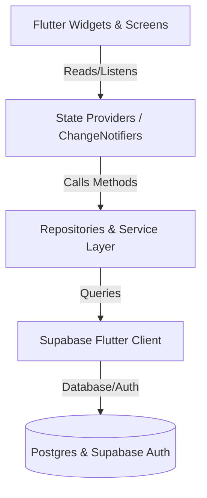

# Supabase & Provider Integration Guide

This document explains how **Supabase** is integrated with the **Provider** state management library in the **UrComputer** project. It details the architecture, data models, authentication flows, database querying, and UI consumption patterns.

---

## 1. Architecture Overview

The application follows a clean layered architecture to decouple UI components from the direct database client.



### Layer Responsibilities:
1. **Database / Auth (Supabase)**: The ultimate data store and security authority.
2. **Supabase Client**: Direct SDK handler.
3. **Repository / Service Layer**: Connects to the Supabase client, performs SQL/Auth operations, maps raw database rows (`Map<String, dynamic>`) to Dart Models, and handles errors.
4. **State Providers (ChangeNotifiers)**: Manages loading states, caches data, retains the active user session, and triggers UI updates via `notifyListeners()`.
5. **UI (Widgets & Screens)**: Listens to Providers, displays layouts, and invokes actions.

---

## 2. Supabase Client Initialization

Before any Supabase action can take place, the SDK is initialized inside the `main()` method of `lib/main.dart`:

```dart
void main() async {
  WidgetsFlutterBinding.ensureInitialized();
  
  // Initialize Supabase Client
  await Supabase.initialize(
    url: 'https://your-supabase-project.supabase.co',
    anonKey: 'your-public-anon-key',
  );

  runApp(const MyApp());
}
```

Once initialized, the client instance is accessible globally throughout the app via:
```dart
SupabaseClient supabase = Supabase.instance.client;
```

---

## 3. Data Models & UUID Binding

Because the database uses `uuid` as primary and foreign key datatypes, all ID fields in Dart models are mapped to `String` (instead of `int`).

### Parsing Fallbacks (e.g. `Product` Model)
Database columns are named in standard `snake_case` (e.g., `category_id`), whereas Flutter apps often use `camelCase` (e.g., `categoryId`). Data models are built with fallback decoding to support both formats seamlessly:

```dart
class Product {
  final String id;
  final String name;
  final double price;
  final String? categoryId;
  final String? brandId;
  final String? image;

  Product({
    required this.id,
    required this.name,
    required this.price,
    this.categoryId,
    this.brandId,
    this.image,
  });

  factory Product.fromJson(Map<String, dynamic> json) {
    return Product(
      id: json['id'].toString(),
      name: json['name'],
      price: (json['price'] as num).toDouble(),
      // Decodes both database field and local JSON formats
      categoryId: json['category_id']?.toString() ?? json['categoryId']?.toString(),
      brandId: json['brand_id']?.toString() ?? json['brandId']?.toString(),
      image: json['image'],
    );
  }
}
```

---

## 4. Authentication Flow (Auth + Database Sync)

To ensure user profiles can hold custom fields (like name, avatar, and billing details) while utilizing secure Supabase credentials, the authentication flow leverages a **two-step synchronization**:

### Step 1: User Sign-Up with Metadata
When a user registers, metadata details (`first_name`, `last_name`, and `phone`) are passed inside the `data` payload of `signUp()`:
```dart
await _supabase.auth.signUp(
  email: email,
  password: password,
  data: {
    'first_name': firstName ?? '',
    'last_name': lastName ?? '',
    'phone': phone ?? '',
  },
);
```

### Step 2: Postgres Trigger Synchronization
Inside the Supabase database, a SQL trigger automatically fires on new inserts to `auth.users`. It extracts the metadata and inserts a record into the public `profiles` table:
```sql
CREATE OR REPLACE FUNCTION public.handle_new_user()
RETURNS trigger AS $$
BEGIN
  INSERT INTO public.profiles (id, email, first_name, last_name, phone)
  VALUES (
    new.id,
    new.email,
    COALESCE(new.raw_user_meta_data->>'first_name', ''),
    COALESCE(new.raw_user_meta_data->>'last_name', ''),
    new.raw_user_meta_data->>'phone'
  );
  RETURN new;
END;
$$ LANGUAGE plpgsql SECURITY DEFINER;

CREATE TRIGGER on_auth_user_created
  AFTER INSERT ON auth.users
  FOR EACH ROW EXECUTE FUNCTION public.handle_new_user();
```

---

## 5. Integrating Supabase with Provider

The `AuthProvider` bridges the `AuthService` and the Flutter UI, maintaining the session state.

### `AuthProvider` State Management:
```dart
class AuthProvider extends ChangeNotifier {
  final AuthService _authService = AuthService();
  
  User? _currentUser;
  bool _isLoading = false;
  String? _errorMessage;
  
  User? get currentUser => _currentUser;
  bool get isLoading => _isLoading;
  String? get errorMessage => _errorMessage;
  bool get isLoggedIn => _currentUser != null;

  AuthProvider() {
    _loadUser(); // Loads active session automatically on start
  }
  
  Future<void> _loadUser() async {
    _currentUser = await _authService.getUserData();
    notifyListeners();
  }
  
  Future<bool> login(String email, String password) async {
    _isLoading = true;
    _errorMessage = null;
    notifyListeners(); // Triggers UI loading indicators
    
    try {
      final success = await _authService.login(email, password);
      if (success) {
        _currentUser = await _authService.getUserData();
        _isLoading = false;
        notifyListeners();
        return true;
      }
      _isLoading = false;
      notifyListeners();
      return false;
    } catch (e) {
      _errorMessage = e.toString();
      _isLoading = false;
      notifyListeners();
      return false;
    }
  }

  Future<void> logout() async {
    await _authService.logout();
    _currentUser = null;
    notifyListeners();
  }
}
```

---

## 6. Querying the Database (Repository Layer)

Repositories query Supabase tables, applying filters and mapping responses to data models.

### Common SQL-to-Supabase Query Examples:

#### 1. Fetching all items (Select *)
```dart
final response = await _supabase.from('categories').select();
return (response as List).map((json) => Category.fromJson(json)).toList();
```

#### 2. Equality filter (`.eq`)
```dart
final response = await _supabase
    .from('products')
    .select()
    .eq('category_id', categoryId); // Filters products by category UUID string
```

#### 3. Sub-queries and Relational Join Filters
To fetch products belonging to a discount tier or containing search keywords:
```dart
final response = await _supabase
    .from('products')
    .select()
    .gt('discount', 0) // Discount greater than 0%
    .ilike('name', '%$query%') // Case-insensitive string search
    .order('price', ascending: true);
```

---

## 7. Dynamic Storage & Media Handling

Product and brand assets are loaded dynamically. If the image reference is an absolute HTTP URL, it displays directly; if it is a relative file path (e.g. `laptop.png`), it is requested from your public Supabase Storage bucket:

```dart
String getImageUrl(String? imagePath, String bucketName) {
  if (imagePath == null || imagePath.isEmpty) return 'assets/placeholder.png';
  
  // If it's already an absolute URL, return it
  if (imagePath.startsWith('http')) return imagePath;

  // Otherwise, construct public storage path
  final supabaseUrl = Supabase.instance.client.supabaseUrl;
  return '$supabaseUrl/storage/v1/object/public/$bucketName/$imagePath';
}
```

---

## 8. Consuming Supabase States inside the UI

To access data and trigger changes in your Flutter UI, use standard `Provider` extension methods:

### Reading Data (One-Time Execution)
Use `context.read<T>()` in event handlers or button presses. Do not use this directly inside the build method:
```dart
// Login button click
ElevatedButton(
  onPressed: () async {
    final success = await context.read<AuthProvider>().login(
      emailController.text,
      passwordController.text,
    );
    if (success) {
      context.go('/home');
    }
  },
  child: const Text('Login'),
)
```

### Listening to State Changes (Reactive UI)
Use `context.watch<T>()` or `Consumer<T>` inside build methods to automatically rebuild the interface when `notifyListeners()` is triggered:

```dart
@override
Widget build(BuildContext context) {
  // Watches AuthProvider state dynamically
  final authProvider = context.watch<AuthProvider>();

  if (authProvider.isLoading) {
    return const Center(child: CircularProgressIndicator());
  }

  return Text(
    authProvider.isLoggedIn 
        ? 'Welcome, ${authProvider.userFullName}!' 
        : 'Please sign in.',
  );
}
```

---

## 9. The Data Flow Journey: From Supabase Table to Flutter UI

To help the team understand how data travels from a database row to a widget, here is a step-by-step walkthrough using the **Product** catalog feature:

### Step 1: The Database Row (PostgreSQL)
In our Supabase database, a record in the `products` table has the following columns:
```sql
id: "d81dfa01-9f9e-4c74-a029-79257e84f702" (uuid)
name: "Apex Gaming PC Setup" (text)
price: 1299.99 (numeric)
category_id: "c81dfa01-9f9e-4c74-a029-79257e84f701" (uuid)
brand_id: "b81dfa01-9f9e-4c74-a029-79257e84f701" (uuid)
image: "apex_pc.png" (text)
```

### Step 2: The Model Mapping (`lib/models/product.dart`)
We write a Dart class with a `fromJson` constructor to transform raw JSON map records returned by the client into type-safe objects:
```dart
class Product {
  final String id;
  final String name;
  final double price;
  final String? categoryId;
  final String? image;

  Product({required this.id, required this.name, required this.price, this.categoryId, this.image});

  factory Product.fromJson(Map<String, dynamic> json) {
    return Product(
      id: json['id'].toString(),
      name: json['name'] as String,
      price: (json['price'] as num).toDouble(),
      categoryId: json['category_id']?.toString(), // Maps snake_case db column
      image: json['image'] as String?,
    );
  }
}
```

### Step 3: The Repository Fetch (`lib/data/repository/product_repository.dart`)
The repository calls the Supabase Client, retrieves a raw list of JSON rows, and converts them to a list of models:
```dart
class ProductRepository {
  final SupabaseClient _supabase = Supabase.instance.client;

  Future<List<Product>> getProductsByCategory(String categoryId) async {
    // 1. Perform network request
    final response = await _supabase
        .from('products')
        .select()
        .eq('category_id', categoryId);
        
    // 2. Cast response list to List of Product models
    return (response as List).map((json) => Product.fromJson(json)).toList();
  }
}
```

### Step 4: The Provider State Manager (`lib/providers/product_provider.dart`)
The provider calls the repository, updates its local state variables, handles errors, and alerts the UI widgets:
```dart
class ProductProvider extends ChangeNotifier {
  final ProductRepository _repository = ProductRepository();
  
  List<Product> _filteredProducts = [];
  bool _isLoading = false;

  List<Product> get filteredProducts => _filteredProducts;
  bool get isLoading => _isLoading;

  Future<void> loadProductsByCategory(String categoryId) async {
    _isLoading = true;
    notifyListeners(); // Tells UI to show loading spinner
    
    try {
      _filteredProducts = await _repository.getProductsByCategory(categoryId);
    } catch (e) {
      debugPrint("Error: $e");
    } finally {
      _isLoading = false;
      notifyListeners(); // Tells UI to hide spinner and display data
    }
  }
}
```

### Step 5: The UI Screen Component (`lib/features/home/home_screen.dart`)
Inside the screen's build method, the widget listens to the state and renders items:
```dart
@override
Widget build(BuildContext context) {
  // 1. Watch the provider for changes
  final productProvider = context.watch<ProductProvider>();

  // 2. Render loading indicator if fetching
  if (productProvider.isLoading) {
    return const Center(child: CircularProgressIndicator());
  }

  // 3. Render grid list of items
  return GridView.builder(
    itemCount: productProvider.filteredProducts.length,
    itemBuilder: (context, index) {
      final product = productProvider.filteredProducts[index];
      return Card(
        child: Column(
          children: [
            Image.network(getImageUrl(product.image, 'products')),
            Text(product.name),
            Text('\$${product.price}'),
          ],
        ),
      );
    },
  );
}
```
